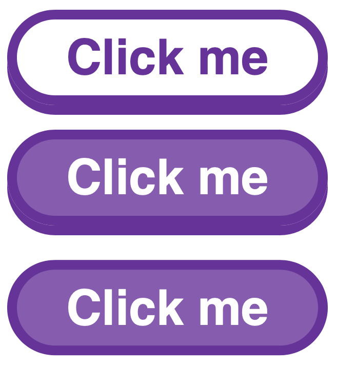

# Challenge - Button from image

## The Task

1. Style the button to match the mock image.
   - Should have hover and active states.

## Mock Image

## Bonus

- Scale the button based on font size only
- Allow for ANY colour to be used on the button.

## Some measurements:

- Starting colour is `rebeccapurple`
- Starting font size is same as body/paragraph
